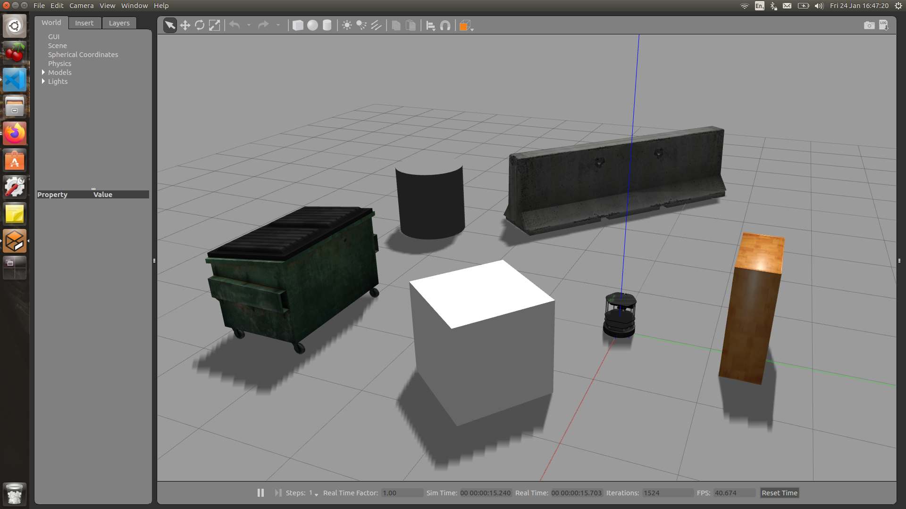
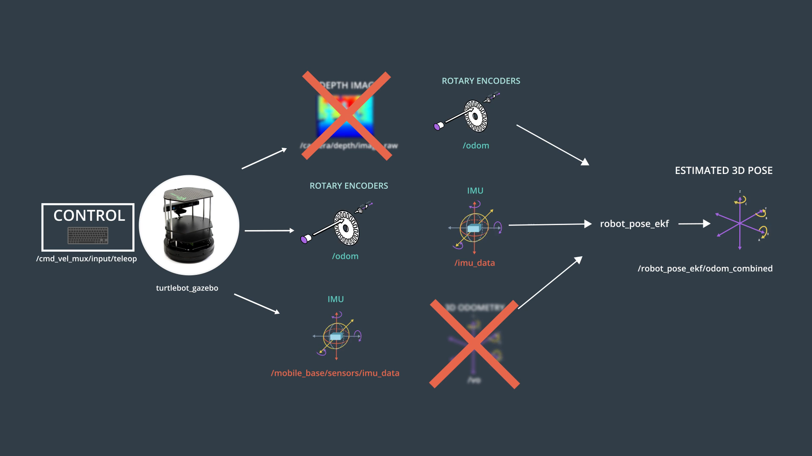
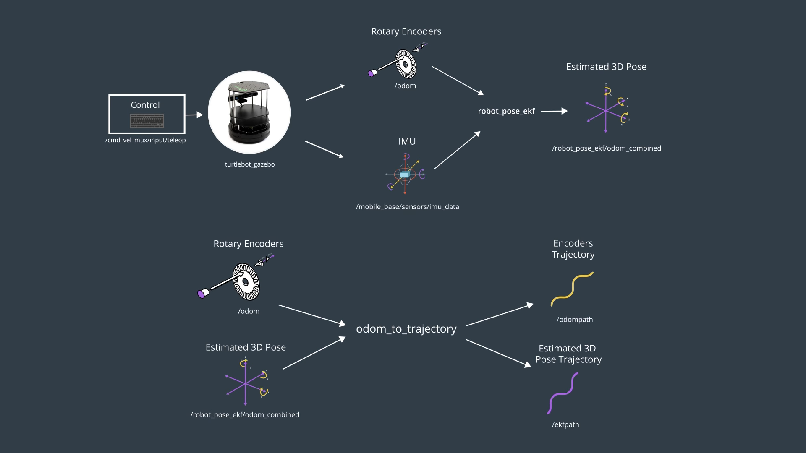
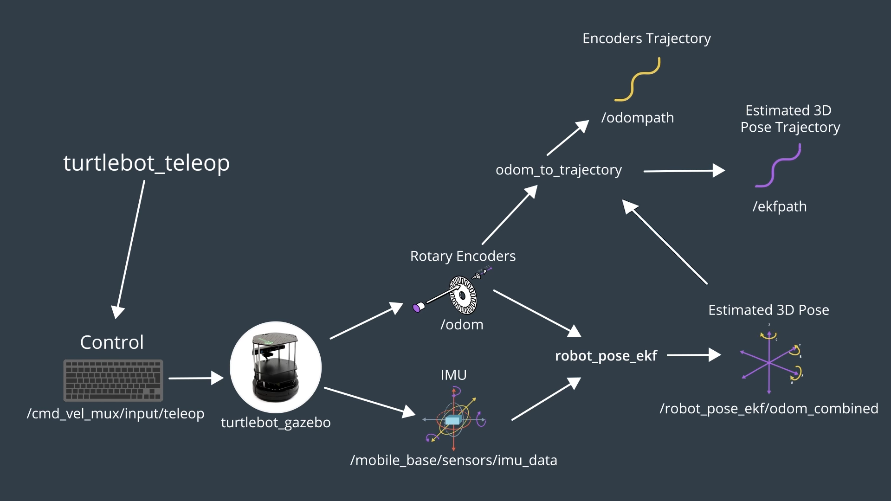

# Sensor_Fusion_Extended Kalman Filter
## Using Gazabo, Rviz, and ROS


## Setting up the enviroment:
For this project the following set up was used:
- Ubuntu 16.04 LTS OS
- Ros kinetic
- Gazebo 7.0.0
- Rviz 1.12.17

## Installation steps:
- Clone this repository to your home directory:
```
$ git clone https://github.com/AndresGarciaEscalante/Sensor_Fusion_EKF
```
- Review the documentation and dependecies of the Packages mentioned below.

- Launch the main file:
```
$ source devel/setup.bash
$ roslaunch main main.launch
```
- Run the rqt_plot package node:
```
$ rosrun rqt_multiplot rqt_multiplot
```
## Project Description
### Turtlebot Package
Provide with a gazebo enviroment and the turtlebot.



For more detailed information please refere to the following link:
[Turtle_bot_Package](https://github.com/turtlebot/turtlebot_simulator)

### Robot Pose EKF Package
Applies **Sensor Fusion** a group of sensors. Some modification were made to interface with the **Turtlebot Package** and the **Robot Pose EKF Package** as shown in the following image:



For more detailed information please refere to the following link:
[Robot Pose EKF Package](https://github.com/udacity/robot_pose_ekf)

### Odometry to Trajectory Package
Allows to display the **Unfiltered and Filtered Position Trajectories**. The result is shown bellow:



For more detailed information please refere to the following link:
[Odometry to Trajectory Package](https://github.com/udacity/odom_to_trajectory)

### TurtleBot Teleop Package
Allows the movement of the **Turtlebot** in the gazebo environment by using keyboards.



For more detailed information please refere to the following link:
[TurtleBot Teleop Package](https://github.com/turtlebot/turtlebot)

## Project Outcome
The main objective of the project is to visualice the efficiency of the **Extended Kalman Filter** to determine the position of the robot. Please check the video:  

[ExtendedKalmanFilterProject](https://www.youtube.com/watch?v=z9RUHgJ8_CY)
